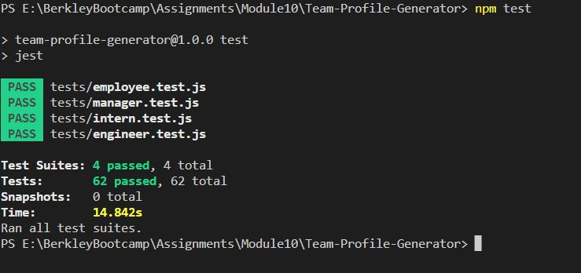

# Team-Profile-Generator
A command line application that takes in information about employees on a software engineering team, then generates an HTML webpage that displays summaries for each person with easy access to their email and GitHub profiles

## Description

Tea Profile Generator takes in information about a team manager and the team members using Node.js command line prompts and then generates a HTML file displaying a nicely formatted team roster based on user input.  Here are the features of this application:

1. When the user starts the application,they are first asked to enter the team manager's nam, id, email and office number.
2. The user is then presented with a menu with the option to add an engineer or an intern or to finish building the team
3. When the user select the "Add an engineer" option, they are prompted to enter the engineer’s name, ID, email, and GitHub username, and then are taken back to the menu.
4. When the user select the "Add an intern" intern option, they are prompted to enter the intern’s name, ID, email, and school, and then are taken back to the menu.
5. When the user decides to finish building the team by selecting "I am done", they exit the application, and the HTML is generated.
6. When the user clicks on an email address in the HTML then the user's default email program opens and populates the TO field of the email with the address.
7. When the user clicks on the GitHub username then that GitHub profile opens in a new tab.

## Technology Used

* Uses the [Inquirer package](https://www.npmjs.com/package/inquirer/v/8.2.4).
* Uses the [Jest package](https://www.npmjs.com/package/jest) for a suite of unit tests.
* The application has `Employee`, `Manager`, `Engineer`, and `Intern` classes stored in 'lib' folder.
* The associated tests for each class are in 'test' folder.


## Installation

  To install necessary dependencies, run the following command:
  ```
  npm i
  ```

## Mock Up

Demo of Project: [Team Profile Generator Demo on Google Drive](https://drive.google.com/file/d/1m7W1FfVjCxuI6oazFl0zihe1y1DuNjzH/view?usp=sharing) 
                  OR [MP4 Demo File in Project](./dist/assets/images/Team-Profile_Generator.mp4)

Sample HTML: [Sample HTML generated](./dist/assets/index_sample.html)

Demo of Tests: [Tests Demo on Google Drive](https://drive.google.com/file/d/1PQTjnXUEW_qackB2nSbUUDJiV_OiSmMb/view?usp=sharing) 
                OR [MP4 Demo File in Project](./dist/assets/images/Tests-Demo.mp4)

Application Screenshot:


Test Screenshot:




## Usage
1. You can access the file in GitHub repository: https://github.com/rbhumbla1/Team-Profile-Generator
2. Run the application in the terminal using this command: 
```
node index.js
```

## License
None

## Contributing

Contact owner

## Tests

  To run tests, please run the following command:
  ```
  npm test
  ```

## Questions

  If you have any questions about the repository and project, or would like to open an issue or would like to contact me for contributing or any other subject, you can do so at rima.bhumbla@gmail.com. You can welcome to see more of my work at https://github.com/rbhumbla1.